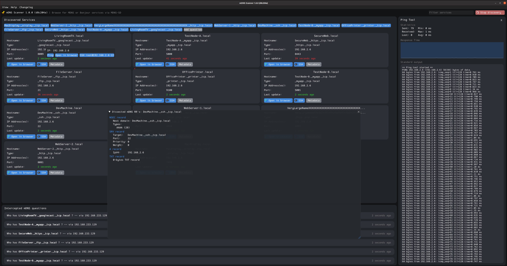

# mDNS Discovery tool

A tools that I've written for fun to play with mDNS proto, it can:
* Discover services via MDNS-SD
* Open discovered services in browser/Open terminal with SSH
* Ping announced IP addresses
* Sniff mDNS discovery questions
* Show which mDNS messages was emitted from the service
* ImGui UI

